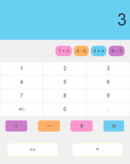
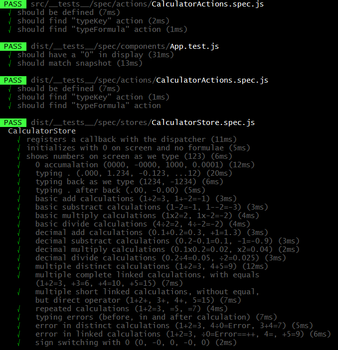

#Version Date **3/20/2019**

[](https://travis-ci.org/HBDunn/rnstruct)
[](https://david-dm.org/HBDunn/rnstruct)

[](https://david-dm.org/HBDunn/rnstruct?type=dev)
[](https://codecov.io/gh/HBDunn/rnstruct/)
[](https://snyk.io/test/github/HBDunn/rnstruct)

# React React-Native Webpack Babel Typescript Jest Travis CI
##**[Migration & Debug Details](./docs/workup.md)** from Javascript React-Native 0.21]
# React-Native@58.4 Mobile & React Website Code-Base Share

Simplify Calculator: single source code architecture to run multiple devices:

- Android(tested) & iOS Apps with [react-native](https://facebook.github.io/react-native))
- Desktop App [TODO: Electron](http://electron.atom.io)
- Website App with [react](https://facebook.github.io/react)

  * Modified and adapted to react-native@**58.4** and react@**16.6.3** by HDunn <hdunn@peswim.com>.
  * MIT License.
  * Original [code] from Benoit Vallon.  
  * Robert O'Dowd authorized Benoit a beautiful ["Simplifycation" design](https://dribbble.com/shots/1973851-Simplifycation).

 [Final Draft ScreenShots]()

| &nbsp; &nbsp; &nbsp; |   Webpage&nbsp; &nbsp; &nbsp; | &nbsp; &nbsp; &nbsp; | &nbsp; &nbsp; Android &nbsp; &nbsp; &nbsp; &nbsp; &nbsp; &nbsp; | &nbsp; &nbsp; &nbsp; |
|----------------------:|:--------------------------:|:--------------:|:-------------------------------------------------------:|:----------------------:|
| &nbsp; &nbsp; &nbsp; |  | &nbsp; &nbsp; &nbsp; |  | &nbsp; &nbsp; &nbsp; |  

## Build/run

### Install

- `npm ci` to install all the dependencies, React and React Native among others.

### The Mobile Apps (iOS & Android)

#### Set-Up for React Native

#### iOS

- OS X
- Xcode 10.0 or higher is recommended (Xcode only runs on Mac).
- Homebrew is the recommended way to install node, watchman, and flow.
- `brew install node`
- `brew install watchman`. We recommend installing watchman, otherwise you might hit a node file watching bug.
- `brew install flow`. If you want to use flow.

##### Android

- Install Android Studio & Build Tools
- [AVD](./docs/cleaning.md#avd)

#Tests
- run
  ```js
    npm test
  ```
- partial screenshot passing

  

##Application Code Structure with Flux(simple Redux) Store

Single source code is all contained in the `src` directory

- `index.ios.(js | ts)` & `index.android.(js | ts)` are the entry points to build the iOS & Android Apps
- `index.(js | ts)` is the entry point to build the Website/Desktop App.

notes:
  - Typescript has been partially implemeted (work in progress at publish date) to show tool-chain functionality.
  - Webpack has not been optimized for production   

### Flux Architecture Actions/Stores

The [flux](https://facebook.github.io/flux) architecture, logic and data management, is shared by all device builds.

### Components

Components are structured to share logic. Logic code paths are only split when a specific device requires different code base,
i.e. a react component ```<div>``` vs react-native component ```<TEXT>```, but the content is single source derived.

Each device's (web/mobile) component main `Class` is inherited from a logic defining base `Class`.
During a build the device main class imports a different *Render function* based on the file name signature.
The file extension `.ios.js`, `.android.js` or `.js` is will be picked by the build tool to import only the correct render file.

 - `.native.js` files contain code that is shared between both mobile platforms (iOS & Android).
 - `.ios.js` and `.android.js` files import the `.native.js` files, currently shared.

However, if a component (ios/android) needs a different platform specific code base, then the platform specific code resides in
io.js or .android.js file.

**Each Component** is defined by six files.

 - Screen component strucure:

	```
	Screen.js
	├── ScreenBase.(jsx?  tsx?)
	├── ScreenRender.ios.(jsx | tsx) (specific to iOS build
	├── ScreenRender.android.(jsx | tsx) (specific to Android build)
	├── ScreenRender.native.(jsx | tsx) (shared mobile app code - iOS & Android)
	└── ScreenRender.(jsx | tsx) (used during Website and Desktop build)
	```

The main `Class` file "Screen.js" which composes the files.

**The react-native compiler/bundler** will only comple  .android. or .ios. and .native. and **ignore** .js

  - js

	```js
	'use strict';

	import Base from './ScreenBase';
	import Render from './ScreenRender';

	export default class Screen extends Base {
	  constructor (props) {
		super(props);
	  }

	  render () {
		return Render.call(this, this.props, this.state);
	  }
	}
	```
  - tsx

    ```js
	'use strict';
	import * as React from 'react';

	interface Props {[key:string]:string};
	interface State {displayScreen:string};
	declare namespace JSX {
	  interface Element {}
	  interface ElementClass {
		render(): any;
	  }
	  interface IntrinsicElements {
		div: {
			className:string;
			style:any;
			};
	  }
	}

	export default function (props: Props,state:State): JSX.Element {
	  return (
		<div className='screen'>
		  {state.displayScreen}
		</div>
	  );
	}
	```
